# Hi, I'm Abhishek AR 👋

  <strong>AI Engineer · Gen AI Engineer · Full-Stack Developer</strong> 
  Building production-grade Generative AI systems, RAG pipelines, agentic workflows and full-stack applications.

<picture>
  <source media="(prefers-color-scheme: dark)" srcset="./dark.svg">
  <source media="(prefers-color-scheme: light)" srcset="./light.svg">
  
</picture>

---

## About Me

I'm an **AI/ML Engineer and Full-Stack Developer** with **3+ years of professional experience** building production-oriented AI and web applications.

My main engineering focus is at the intersection of:

- 🤖 Generative AI & LLM applications
- 🧠 RAG and vector retrieval
- 🔗 Agentic AI and multi-agent orchestration
- ⚙️ Python AI backends and APIs
- 🌐 ReactJS / Vue.js full-stack applications
- 👁️ Computer vision
- 🔌 MCP-based AI integrations
- ☁️ AWS, Docker and event-driven systems

I enjoy taking an AI feature from **prompt and orchestration → backend service → frontend experience → deployment**.

---

## 🧠 AI Engineering

### Generative AI
`LangChain` · `LangGraph` · `LlamaIndex` · `RAG` · `Agentic AI` · `Prompt Engineering` · `LLM Tool Use` · `MCP`

### LLM APIs
`Anthropic Claude API` · `OpenAI API` · `LiteLLM` · `Open-Source LLMs`

### Retrieval & Vector Systems
`Qdrant` · `ChromaDB` · `FAISS` · `Typesense` · `pgvector`

### Computer Vision / ML
`InsightFace` · `CLIP` · `YOLO` · `Scikit-learn` · `TensorFlow` · `Pandas` · `MLflow`

---

## ⚙️ Full-Stack Engineering

**Backend:**  
`Python` · `FastAPI` · `Django` · `Django REST Framework` · `Flask` · `Async Python` · `Kafka` · `WebSockets`

**Frontend:**  
`ReactJS` · `Vue.js` · `HTML5` · `CSS3`

**Data:**  
`PostgreSQL` · `MySQL` · `Redis`

**Cloud / DevOps:**  
`AWS EC2` · `Docker` · `Nginx` · `Gunicorn` · `Celery` · `Git` · `Cron Jobs`

**Data Extraction / Automation:**  
`Bright Data` · `Playwright` · `BeautifulSoup`

---

## 💼 Experience

### AI Engineer — CodePoint Softwares
**Nov 2025 – Present · Remote**

- Building Python-based AI backend services and LLM orchestration pipelines.
- Designing multi-agent workflows with **LangGraph**.
- Implementing per-tenant RAG systems using **LlamaIndex + Qdrant**.
- Integrating **Anthropic Claude API** and **OpenAI API**.
- Building ReactJS and Vue.js interfaces that surface AI-generated results.
- Developing Human-in-the-Loop agentic systems with **Kafka and Redis**.
- Building MCP servers for HR automation workflows.
- Working with computer vision and real-time face recognition using **InsightFace**.
- Using Bright Data infrastructure for large-scale data extraction and AI/RAG pipelines.
- Using Claude Code and Cursor for AI-augmented development workflows.

### Software Developer — SMBS Infolab LLC
**Aug 2023 – Nov 2025 · Kochi, Kerala**

- Developed production full-stack applications with Python, Django and Django REST Framework.
- Deployed applications using AWS EC2, Nginx, Gunicorn and Docker.
- Built asynchronous workflows with Celery.
- Developed REST APIs and real-time features using Django Channels and WebSockets.
- Worked on e-commerce CRM, Stripe payments, partner management and automated billing.
- Built QR-code management and WhatsApp Business API automation workflows.

### Python Developer — Inet Infotech
**Jul 2022 – Jul 2023 · Ernakulam, Kerala**

- Conducted training in Python, Django, Flask, Data Science and Machine Learning.
- Developed curriculum and hands-on project materials.
- Mentored students on real-world Django/Flask applications and REST architecture.

### Junior Python Developer Intern — Inmakes Infotech
**Jan 2022 – Apr 2022 · Ernakulam, Kochi**

- Trained in Python, Django, Flask, REST APIs, Data Science and Machine Learning.
- Built foundational Django and REST architecture projects.

---

## 🚀 Featured Projects

### 1. Agentic AI Full-Stack App Generator
**LangGraph · LangChain · FastAPI · ReactJS · Python · Docker · Git**

A multi-agent application generator using planning, coding and deployment agents to create working applications from natural-language prompts.

### 2. Advanced Agentic Chatbot with RAG + Privacy Layer
**FastAPI · LiteLLM · LangChain · OpenAI API · PostgreSQL · Redis · Celery**

Context-aware LLM chatbot with tool use, vector retrieval, PII tokenization, agentic reminders and automated embedding maintenance.

### 3. Advanced RAG Pipeline with Typesense Hybrid Search
**Typesense · FastAPI · OpenAI Embeddings · Redis · Python**

Hybrid retrieval combining dense embeddings with typo-tolerant keyword search, real-time ingestion and relevance scoring.

### 4. HR Management MCP Server
**MCP · Anthropic Claude API · FastAPI · Python · Pandas · SMTP**

MCP-based HR automation server supporting leave management, approval workflows and natural-language HR data retrieval.

### 5. Multimodal Information Retrieval System
**CLIP · YOLO · FAISS · LLM Embeddings · FastAPI · Python**

Hybrid text-and-image retrieval using visual embeddings, object detection, query enhancement and approximate nearest-neighbour search.

### 6. InsightForge — No-Code ML Dashboard
**Django · Python · Scikit-learn · TensorFlow · Pandas · JavaScript**

A browser-based ML dashboard for dataset upload, model training, prediction and feature-engineering workflows.

### 7. Bright Data Large-Scale Scraping & ETL Pipeline
**Bright Data · Playwright · BeautifulSoup · FastAPI · PostgreSQL · Redis**

ETL infrastructure for collecting structured data and feeding downstream vector databases and AI/RAG systems.

---

## 🎓 Education

**MSc in Electronics**  
Marthoma College of Science and Technology — University of Kerala  
2020 – 2022

**BSc in Electronics**  
IHRD College of Applied Science Kundara  
2017 – 2020

---

## 📫 Connect

- **Email:** [abhishekar3690@gmail.com](mailto:abhishekar3690@gmail.com)
- **GitHub:** [github.com/abhishekpythoninmakes](https://github.com/abhishekpythoninmakes)
- **Location:** Kerala, India

---

  AI Engineering · Agentic Systems · RAG · Full-Stack Development

